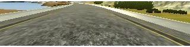

# Behavioral Cloning (Udasity)
 
## Overview
  
>This is Udacity's Self-Driving Car Nanodegree Project No.3.
> 
> The Goals and Steps of this project are following:
> 
> 1. Data Collection
> 2. Preprocessing Images and Augmentation
> 3. Build and Train Neural Network
> 4. Test Model and Simulation in Beta-Simulation
  
##Before start this project,  
 
* NVIDIA 2016 Paper [End to End Learning for Self-Driving Cars](http://images.nvidia.com/content/tegra/automotive/images/2016/solutions/pdf/end-to-end-dl-using-px.pdf)
would be good guide to understand the exact concept. 
* [comma.ai](https://github.com/commaai/research) shared their dataset & codes. 

## Installation & Environment  
 
### Installation
 
* __Simulator__  
 
    [Windows 64 bit](https://d17h27t6h515a5.cloudfront.net/topher/2016/November/5831f3a4_simulator-windows-64/simulator-windows-64.zip)  
    [macOS](https://d17h27t6h515a5.cloudfront.net/topher/2016/November/5831f290_simulator-macos/simulator-macos.zip)  
    [Linux](https://d17h27t6h515a5.cloudfront.net/topher/2016/November/5831f0f7_simulator-linux/simulator-linux.zip)
  
* __Dataset__  
 
    [data](https://d17h27t6h515a5.cloudfront.net/topher/2016/December/584f6edd_data/data.zip) (Track1 data provided by Udacity)
 
 
### Environment  
  
#### software
>Windows 10(x64), tensorflow 2.4.0, Python 3.8.5, OpenCV 4.5.1, pycharm
> 
#### hardware  
  
>CPU : i7-10700k 3.80GHz, Memory : 16.0GB, NVIDIA GeForce RTX 2060
    
## Files
  
[`model.py`](model.py) : training model in tensorflow 2.4.0

[`drive.py`](drive.py) : simulation start for driving car
 
[`model.json`](model.json) : Trained model

[`model.h5`](model.h5) : Trained weight

## Data Collection  

In the simulator, we have two modes and two racing tracks.  
 
**`TRAINING MODE`** : Coltrol a car with keyboard or joystick. Collect image datas by clicking a record button.  
 
**`AUTONOMOUS MODE`** : Test my trained car.  

**Data Collecting**
- Before start training & running Simulation, collecting recorded images through three forward facing cameras mounted on the vehicle
- image types: Center, Left, Right
- The Simulation also outputs an accociated steering angle which is used as a label for the images

| Left          | Center        | Right  |
| ------------- |:-------------:| ------|
| |  | 

**Dataset**

I used [udacity dataset](https://d17h27t6h515a5.cloudfront.net/topher/2016/December/584f6edd_data/data.zip) because I didn't have a joystick. And those files more Better than the data I extracted.

## Preprocessing Images and Augmentation
### Generators  
The Dataset has limited angles of steering. So I needed to increase more data for network model. I used generator in python to solve the memory problem. In "Keras" of the "Tensorflow 2.4.0", they provided "fit_generator()" function
and allow to do real-time image data augmentation in parallel to training this model.

### Augmentation Data (image)
I added `Left, Right images` and used `flip`, `shift`, `change brightness`, `generate shadow` methods.  

As You can see in this images, there have three sub-images about "Left", "Center", "Right". And the most important thing when I add offset angle to the Left, Right images.
I should reward proper angle of the offset. To calculate the exact offset, I need some information. But I didn't have any information about setting environment. After testing over 100, I decided to take the 
"offset value" = 0.22

* __Flip image__
  - After Flipping, I could balance left and right angle and augment data. And I reverse plus, minus sign of steering angle when flipping.
  
  
* __shift image__
  - Moving the image into the x-axis direction and get lots of data. And I should reward some offset data again 'Left' and 'Right' image. After lots of test, I deceided to take Angle per Pixel = 0.0025.
  

* __change brightness__
  - To be a invariant of brightness, I need to change brightness artificially. I converted RGB to HSV color format and changed V channel value.
  
 
* __generate shadow__

  - This Method is used for Fantastic Graphic mode. Udacity data got fantastic graphic mode. In that, there are many shadows. So I generated shadowing artificially.
  
  
  
### Image Cropping   

I cropped 2 portion of the image about Bonnet and Background. Those aren't necessary to decide a exact steering angle.
 
### Resizing  

I resized image to 64x64 after Image data augmentation and cropping Image.
I tried 200x66 and 64x32 size but 64x64 size was best in my model and parameter setting.
I also tested 128x128 size for better layer feature map resolution, the result was similar with 64x64.  
  
  
## Build and Train Neural Network
  
In this network model, 
- **Lambda** (Output Shape = (None, 64, 64, 3)) -> param [0]
- **Conv2D** (Output Shape = (None, 22, 22, 32)) -> param [896]
- **Max Pooling 2D** (Output Shape = (None, 11, 11, 32)) -> param [0]
- **Conv2D** (Output Shape = (None, 4, 4, 64)) -> param [18496]
- **Max Pooling 2D** (Output Shape = (None, 2, 2, 64)) -> param [0]
- **Conv2D** (Output Shape = (None, 1, 1, 128)) -> param [73856]
- **Max Pooling 2D** (Output Shape = (None, 1, 1, 128)) -> param [0]
- **Conv2D** (Output Shape = (None, 1, 1, 128)) -> param [65664]
- **Flatten** (Output Shape = (None, 128)) -> param [0]
- **Dropout** (Output Shape = (None, 128)) -> param [0]
- **Dense** (Output Shape = (None, 128)) -> param [16512]
- **Dropout** (Output Shape = (None, 128)) -> param [0]
- **Dense** (Output Shape = (None, 128)) -> param [16512]
- **Dropout** (Output Shape = (None, 128)) -> param [0]
- **Dense** (Output Shape = (None, 64)) -> param [8256]
- **Dense** (Output Shape = (None, 1)) -> param [65]
- **Total Params**: 200,257
- **Trainable Params**: 200,257
- **Non-trainable Params**: 0

[1] Add Lambda layer to normalize images [0:255] ~ [-1:1]. This method is used in Comma.ai model.

[2] Add 4 Convolutional layers.

[3] Filter size 3x3 and 2x2

[4] I used relu as a Activation Function, glorot_uniform for weight initialization, Max pooling and 3 Fully Connected layers. And I added Dropout layer. 

[5] I used Adam Optimizer for training, Learning rate = 0.0001, Batch size = 256, epoch = 10, step_per_epoch=10000

[6] I separated validation dataset [10%] after Shuffling.

After finish run training model, I got loss: 0.0099, val_loss: 0.0091

## Test Model and Simulation in Beta-Simulator  

The drive.py script takes a constant stream of images, resizes and crops them to fit the model's input shape, and passes an array of transformed images to the model that predicts the appropriate steering angle based on the image. Then the steering angle is transmitted to the vehicle to the control device and the vehicle steers itself accordingly. I hope that Autonomous vehicle continue to output images and receive steering angles as they drive through the course like this, and that the steering angle the model receives is sufficiently trained to keep the vehicle driving safely in the middle of the lane and not drifting on the road. Or do other things that are considered dangerous.

The data collection and preprocessing techniques and model architecture described above were sufficient to build a model that safely drives multiple wheels without hitting a curb or drifting on the road.